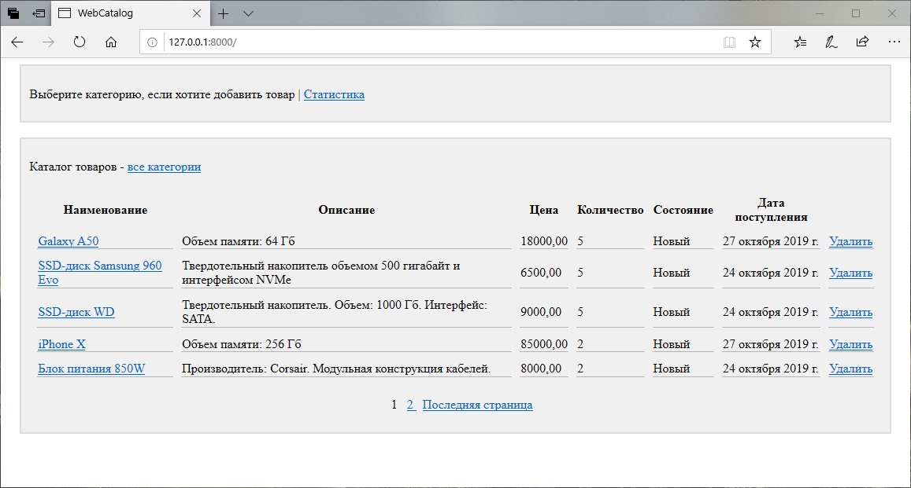
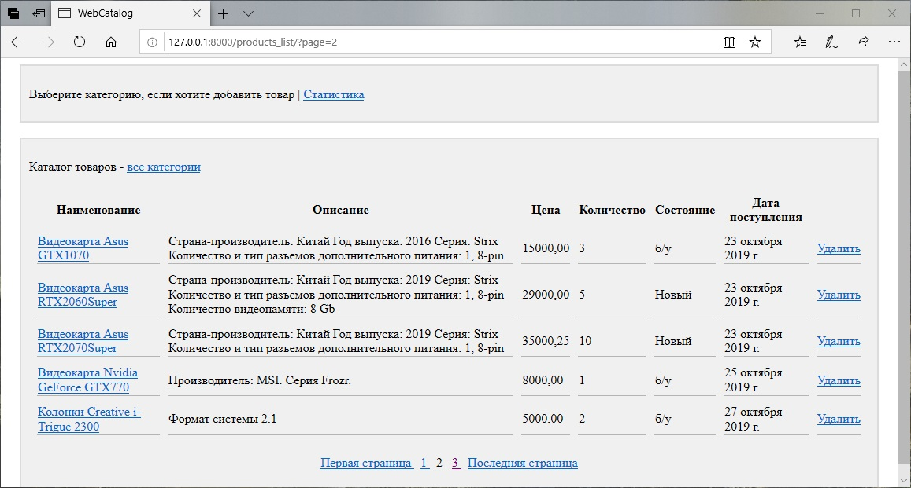
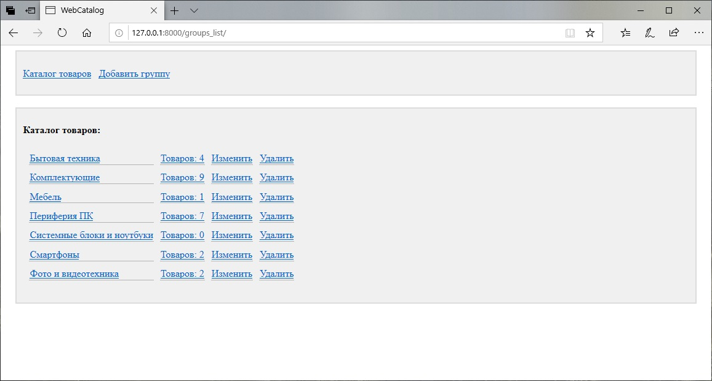
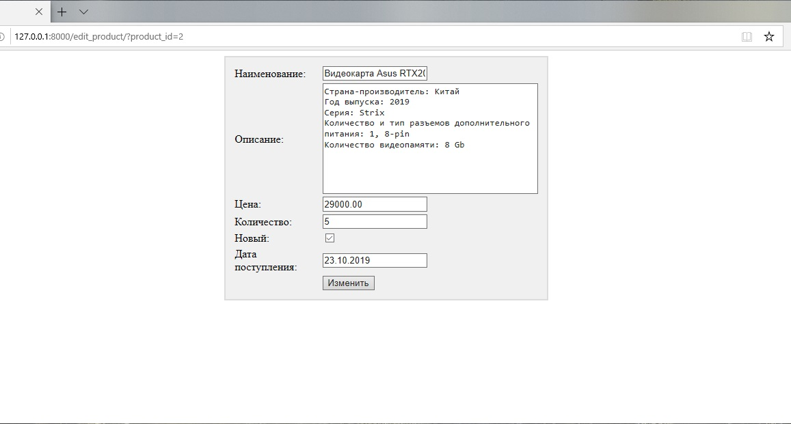
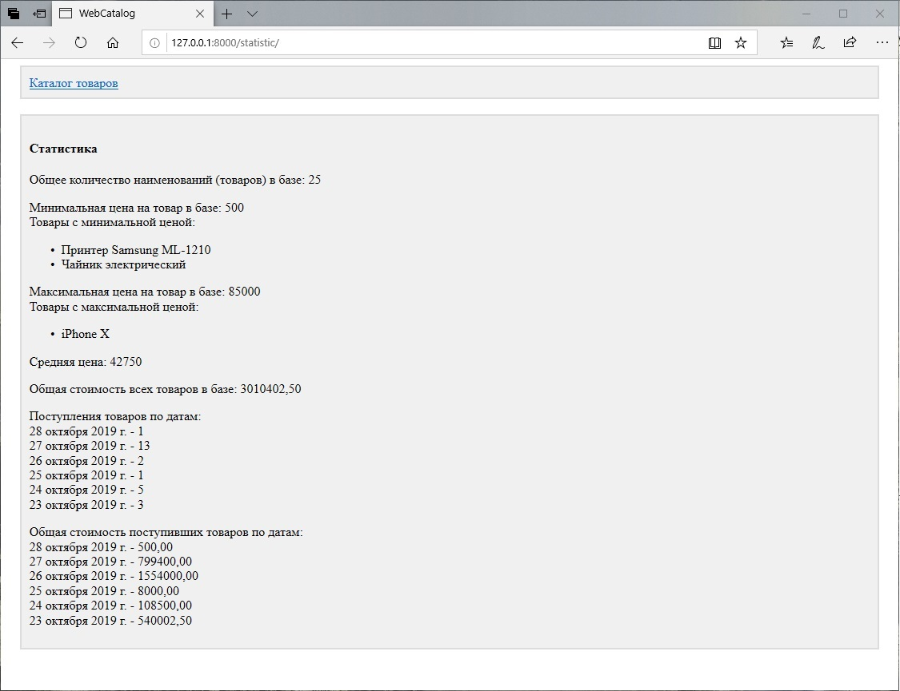

# WebCatalog
Учебный проект по Django

Проект представляет собой небольшое web-приложение для работы с базой данных товаров. Товары разбиты на категории (которые могут быть вложенными друг в друга). По каждому товару вносится его наименование, описание, цена, состояние (новый или б/у). Также доступны операции с категориями: создание, изменение, удаление (в случае удаления категории удаляются и все вложенные в неёподкатегории и товары).
Цель данного проекта для меня - научиться работать с базовыми инструментами Django: моделями, формами, контроллерами-классами, методами выборки информации из моделей.

Скриншоты ниже:

